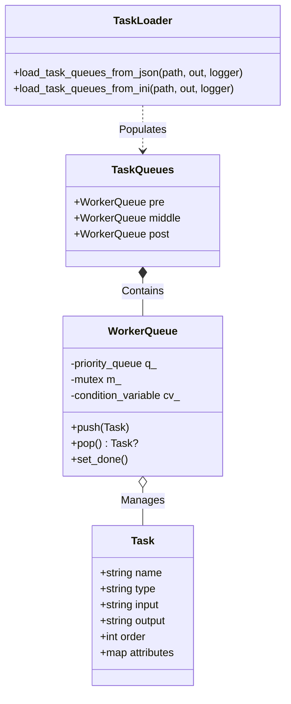
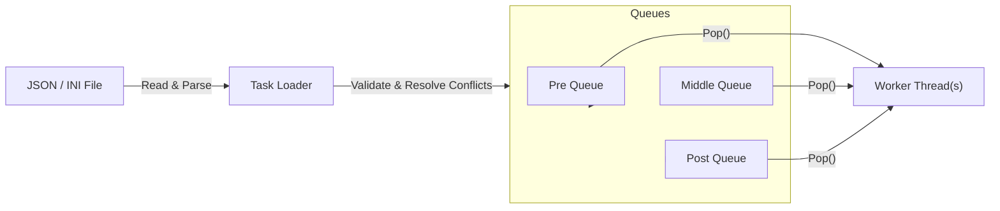

# TaskQueue Library

C++23 shared library for loading task definitions from **JSON** or **INI** configuration files and distributing them into three independent, thread‑safe worker queues (`pre`, `middle`, `post`).

[](https://opensource.org/licenses/MIT)
[]()
[]()

[](https://github.com/Zheng-Bote/gh-update-checker/releases)

[Report Issue](https://github.com/Zheng-Bote/gh-update-checker/issues) · [Request Feature](https://github.com/Zheng-Bote/gh-update-checker/pulls)

---

<!-- START doctoc generated TOC please keep comment here to allow auto update -->
<!-- DON'T EDIT THIS SECTION, INSTEAD RE-RUN doctoc TO UPDATE -->
<!-- END doctoc generated TOC please keep comment here to allow auto update -->

---

## Description

TaskQueue is a lightweight C++23 shared library for loading task definitions from **JSON** or **INI** configuration files and distributing them into three independent, thread‑safe worker queues (`pre`, `middle`, `post`).  
The library enforces unique task names, resolves ordering conflicts per queue, and exposes both a C++ API and a C API for integration with other languages.

## Features

- **Multi-Format Configuration**: Load tasks seamlessly from **JSON** or **INI** files.
- **Three-Stage Workflow**: Independent queues for `pre`, `middle`, and `post` processing stages.
- **Thread-Safety**: Built-in thread-safe priority queues for concurrent consumer access.
- **Conflict Resolution**: Automatic order adjustment for conflicting priorities.
- **Uniqueness**: Enforces unique task names (first declaration wins).
- **Flexible Logging**: Customizable logging callbacks for integration with existing logging frameworks.
- **Dual API**: Full C++23 API and a C interop layer (FFI-ready).
- **Modern Build System**: CMake 3.28+ with `pkg-config` and `find_package` support.

---

## Architecture

The TaskQueue library is designed around a central loader that reads configuration (JSON/INI) and populates three distinct worker queues.

### Component Diagram



### Data Flow



---

## INI Format

> [!NOTE]
> The INI format should only be used for smaller configurations.

The INI loader expects sections prefixed with `task:` to define tasks. Each section acts as a task definition.

- **Section Name**: `[task:<unique_name>]`
- **Keys**:
  - `type`: Target queue - `pre`, `middle`, or `post`.
  - `order`: Execution priority (integer).
  - `input`: Input data payload.
  - `output`: Expected output destination.
  - `attr`: Optional key-value attributes (format: `key1=val1,key2=val2`).

**Example `data.ini`:**

```ini
[task:pre_task_01]
type = pre
order = 1
input = alpha
output = result_alpha
attr = owner=robert,category=init

[task:middle_task_01]
type = middle
order = 1
input = m1
output = m1_out
attr = priority=low

[task:post_task_01]
type = post
order = 5
input = p1
output = p1_out
```

## JSON Format

Each task object in the JSON array must contain:

- `name` (string, unique): Unique identifier for the task.
- `type` (string): Target queue - `"pre"`, `"middle"`, or `"post"`.
- `order` (integer): Execution priority (lower value = earlier execution, pending conflict resolution).
- `input` (string): Input data payload.
- `output` (string): Expected output destination.
- `attr` (array): Optional key-value attributes.

**Example `data.json`:**

```json
[
  {
    "name": "pre_task_01",
    "type": "pre",
    "order": 1,
    "input": "alpha",
    "output": "result_alpha",
    "attr": [{ "key": "owner", "value": "robert" }]
  },
  {
    "name": "middle_task_01",
    "type": "middle",
    "order": 10,
    "input": "beta",
    "output": "result_beta",
    "attr": []
  }
]
```

---

## API Documentation

### C++ API (`include/task_loader.hpp`)

#### `struct Task`

Represents a single unit of work.

- `name`: Unique identifier.
- `type`: Queue type (`pre`, `middle`, `post`).
- `order`: Sorted order in the queue.
- `attributes`: Custom key-value pairs (`std::unordered_map`).

#### `class WorkerQueue`

A thread-safe priority queue.

- `void push(Task t)`: Adds a task.
- `std::optional<Task> pop()`: Retrieves the next task (blocks if empty, returns `nullopt` if finished).
- `void set_done()`: Signals that no more tasks will be added, unblocking waiters.

#### Loader Functions

```cpp
// Load from JSON
TQ_Error load_task_queues_from_json(
    const std::string &path,
    TaskQueues &out,
    const TQ_Logger &logger
);

// Load from INI
TQ_Error load_task_queues_from_ini(
    const std::string &path,
    TaskQueues &out,
    const TQ_Logger &logger
);
```

### C API (`include/c_api.h`)

Designed for FFI (Foreign Function Interface).

- `tq_load_json(path, logger, out)`: Loads JSON and allocates opaque queue object.
- `tq_load_ini(path, logger, out)`: Loads INI and allocates opaque queue object.
- `tq_free(q)`: Destroys the queue object.

---

## Build & Install

### Requirements

- **C++23** compliant compiler (GCC 13+, Clang 16+, MSVC 19.36+)
- **CMake 3.28+**

### Building

```bash
cmake -S . -B build
cmake --build build -j$(nproc)
```

### Testing

```bash
cd build && ctest --output-on-failure
```

### Installation

```bash
sudo cmake --install build
```

---

## Integration

### Using `find_package` (CMake)

Once installed, use the exported CMake configuration:

```cmake
find_package(taskqueue REQUIRED)

add_executable(my_app main.cpp)
target_link_libraries(my_app PRIVATE taskqueue::taskqueue)
```

### Using `pkg-config`

Use pkg-config for C‑Buildsystem or Makefiles

```bash
pkg-config --cflags --libs taskqueue
```

### Using `FetchContent`

Use FetchContent (CMake‑only):

```cmake
include(FetchContent)

FetchContent_Declare(
    taskqueue
    GIT_REPOSITORY https://github.com/robert/taskqueue.git
    GIT_TAG main
)
FetchContent_MakeAvailable(taskqueue)

target_link_libraries(my_app PRIVATE taskqueue::taskqueue)
```

---

## Example Usage

### C++ Example INI-File

```cpp
#include <task_loader.hpp>
#include <iostream>

int main() {
    // 1. Define Logger
    TQ_Logger logger{
        [](const std::string& s){ std::cout << "[INFO] " << s << "\n"; },
        [](const std::string& s){ std::cout << "[WARN] " << s << "\n"; },
        [](const std::string& s){ std::cout << "[ERROR] " << s << "\n"; }
    };

    // 2. Load Queues (INI Example)
    TaskQueues queues;
    if (load_task_queues_from_ini("data.ini", queues, logger) != TQ_Error::Ok) {
        return 1;
    }

    // 3. Process Tasks
    queues.pre.set_done(); // Signal no more tasks coming
    while (auto t = queues.pre.pop()) {
        std::cout << "Processing: " << t->name << "\n";
    }

    return 0;
}
```

### C++ Example JSON-File

```cpp
#include <task_loader.hpp>
#include <iostream>

int main() {
    // 1. Define Logger
    TQ_Logger logger{
        [](const std::string& s){ std::cout << "[INFO] " << s << "\n"; },
        [](const std::string& s){ std::cout << "[WARN] " << s << "\n"; },
        [](const std::string& s){ std::cout << "[ERROR] " << s << "\n"; }
    };

    // 2. Load Queues
    TaskQueues queues;
    if (load_task_queues_from_json("data.json", queues, logger) != TQ_Error::Ok) {
        return 1;
    }

    // 3. Process Tasks
    queues.pre.set_done(); // Signal no more tasks coming
    while (auto t = queues.pre.pop()) {
        std::cout << "Processing: " << t->name << "\n";
    }

    return 0;
}
```

---

# License

Distributed under the MIT License. See LICENSE for more information.

Copyright (c) 2026 ZHENG Robert

# Author

[](https://www.github.com/Zheng-Bote)

## Code Contributors


---

**Happy coding! 🚀** :vulcan_salute:
